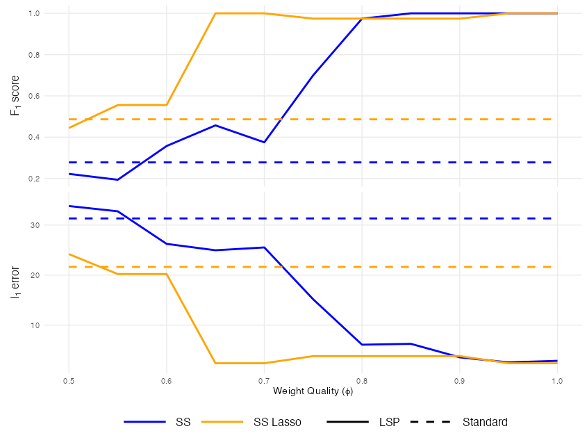
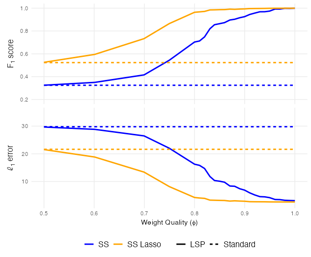

# LLM Sparsity Prior for Robust Feature Selection

This repository contains an implementation of the **LLM Sparsity Prior**, a Bayesian variable selection framework that integrates *a priori* feature importance synthesized by Large Language Models (LLMs) into the Spike-and-Slab and Spike-and-Slab Lasso priors.

This repository is organized to support three primary objectives:
1) Core implementation: Efficient posterior estimation for LSP methods.
2) Simulations: Comparative simulation studies.
3) Data Application: Prompt engineering templates and Acute Kidney Injury (AKI) analysis.

## Repository Structure
```text
.
├── AKI Data Application/
│   ├── analysis/
│   │   ├── aki_analysis_support.R      # Support functions for AKI Analysis
│   │   ├── aki_subsets.R               # Script to run analysis over five subsets
│   │   ├── aki_low_data.R              # Script to run analysis over low-data regime
│   │   └── aki_weight_sensitivity.R    # Script to run sensitivity analysis
│   ├── weight_prompts/
│   │   ├── prompty_adjust_collinearity_constraints.ipynb   # Prompt to generate LLM weights from GPT 5.2o (Collinearity Constraints Adjusted)
│   │   ├── prompty_adjust_reasoning_structure.ipynb        # Prompt to generate LLM weights from GPT 5.2o (Reasoning Structure Adjusted)
│   │   ├── prompty_adjust_scoring_rubric10.ipynb           # Prompt to generate LLM weights from GPT 5.2o (Scoring Rubric Adjusted)
│   │   ├── prompty_adjust_task.ipynb                       # Prompt to generate LLM weights from GPT 5.2o (Task Definition Adjusted)
│   │   ├── prompty_original.ipynb                          # Prompt to generate LLM weights from GPT 5.2o (Original)
│   │   └── prompty_adjust_probabilities.ipynb              # Prompt to generate Naive LLM weights from GPT 5.2o (Probabilities)
│   └── weights/                        # directory of generated weights: five prompt variants by five runs and naive weights
├── LSP_SS/
│   ├── LSP_SSR_fixed_s.R               # MCMC Sampler for LSP (SS) with Fixed Sparsity
│   └── LSP_SSR_random_s.R              # MCMC Sampler for LSP (SS) with Random Sparsity
│── LSP_SSL/
│   ├── LSP_SSLR.R                      # R Function for MAP Estimation of LSP (SSL)
│   ├── LSP_SSL_descent.c               # C code for coordinate descent algorithm (lightly edited from https://github.com/cran/SSLASSO)
│   └── LSP_SSL_functions.c             # C functions for the descent algorithm
├── Simulations/
│   ├── weight_quality_sims.R           # Main script to run simulations
│   ├── eta_sensitivity_sims.R          # Script to run simulations on eta sensitivity analysis
│   └── weight_quality_support.R        # Support functions for weight generation, metric computation, etc.
└── README.md
```

## Installation and Dependencies
The core method, simulation scripts, and data analysis are written in R. To run these, be sure the following packages are installed:
```r
install.packages(c("MASS", "tidyverse", "hypergeo", "glmnet", "furrr", "pROC", "tidymodels", "simstudy", "Mhorseshoe", "latex2exp", "ggh4x"))
```

Spike-and-Slab Lasso files must be compiled locally. Run the following command in your terminal at the repository root.
```bash
cd LSP_SSL
R CMD SHLIB LSP_SSL_descent.c LSP_SSL_functions.c -o lsp_ssl.so
```

## Usage Example
```r
source("LSP_SS/LSP_SSR_random_s.R")
source("LSP_SSL/LSP_SSLR.R")

# Generate synthetic data
set.seed(1); n <- 50; p <- 100; signals <- 5

X <- MASS::mvrnorm(n, mu = rep(0, p), diag(p))
beta_true <- c(rep(0, p - signals), rep(1, signals))
alpha_true <- 1
y <- X %*% beta_true + alpha_true + rnorm(n, 0, sd = 1)

# Define LLM-generated feature weights (in practice, these come from the LLM prompt)
weights <- c(rep(1, p - signals), rep(5, signals)) # perfect weights

# Run ADS sampler with default settings
lsp_ss_fit <- lsp_random_ss_gibbs_sampler(
  X = X,
  y = y,
  weights = weights)

# Extract Posterior Means
lsp_ss_beta_est <- colMeans(lsp_ss_fit$beta)

# Run SSL coordinate descent (MAP estimation)
lsp_ssl_fit <- lsp_ssl_map(
  X = X,
  y = y,
  weights = weights,
  penalty = "adaptive")

 # Select model from descent (use BIC to select lambda_0)
 lsp_ssl_beta_est <- select_lambda0_bic(lsp_ssl_fit, X = X, y = y)

 # Print estimates
 round(lsp_ss_beta_est, digits = 2)
 # [1] 0.76 0.00 0.00 ... 0.00 0.85 1.05 1.11 0.86 1.15
 round(as.vector(lsp_ssl_beta_est), digits = 2)
 # [1] 0.78 0.00 0.00 ... 0.00 0.84 1.05 1.12 0.86 1.15
```

## Reproduce Weight Quality Simulations (One Replication)
```r
source("LSP_SS/LSP_SSR_random_s.R")
source("LSP_SSL/LSP_SSLR.R")
source("Simulations/weight_quality_support.R")

# Generate synthetic data
set.seed(1); n <- 100; p <- 1000; signals <- 20
cov_mat <- simstudy::genCorMat(p, cors = rep(0.5, choose(p, 2)))
X <- MASS::mvrnorm(n, mu = rep(0, p), cov_mat)
gamma_true <- c(rep(0, p - signals), rep(1, signals))
beta_true <- c(rep(0, p - signals), rep(1, signals))
alpha_true <- 1
y <- X %*% beta_true + alpha_true + rnorm(n, 0, sd = 1)

# Train Baseline Models
baseline_ssl <- lsp_ssl_map(
      X,
      y,
      penalty = "adaptive"
    ) |>
      select_lambda0_bic(X = X, y = y)

baseline_ss <- lsp_random_ss_gibbs_sampler(
      X,
      y,
      iter = 30000,
      burn_in = 5000,
      return_samples = FALSE)

# Define feature weight quality grid
phi_range <- c(0.5, 0.55, 0.6, 0.65, 0.7, 0.75, 0.80, 0.85, 0.90, 0.95, 1.00)
eta_range <- seq(1, 10, by = 1)

metrics <- map_dfr(phi_range, function(phi) {
  # Generate weights according to weight quality
  weights <- generate_weights(phi, gamma_true, categories = 5)

  # Train LSP models
  lsp_ss_fit <- lsp_random_ss_gibbs_sampler(
    X = X, y = y, E_space = eta_range, weights = weights, iter = 30000,
      burn_in = 5000, return_samples = FALSE
  )

  lsp_ssl_fit <- lsp_ssl_map(
    X = X, y = y, E_space = eta_range, weights = weights, penalty = "adaptive"
  ) |>
    select_lambda0_bic(X = X, y = y)

  all_fits <- list(
    "Standard_SS_Lasso" = baseline_ssl,
    "Standard_SS"       = baseline_ss,
    "LSP_SS_Lasso"      = lsp_ssl_fit,
    "LSP_SS"            = lsp_ss_fit
  )

  # Compute l_1 error and F_1 Score
  imap_dfr(all_fits, function(model_object, model_name) {
    if (is.numeric(model_object)) {
      gamma_predict <- as.vector(model_object != 0)[-1]
      l1_error <- sum(abs(as.vector(model_object) - c(alpha_true, beta_true)))
    } else {
      gamma_predict <- model_object$gamma
      l1_error <- sum(abs(model_object$beta - c(alpha_true, beta_true)))
    }

    fp <- length(which(gamma_predict[gamma_true == 0] > 0.5))
    fn <- length(which(gamma_predict[gamma_true == 1] < 0.5))
    tp <- sum(gamma_true) - fn
    
    precision <- if_else(tp == 0, 0, tp / (tp + fp))
    recall <- if_else(tp == 0, 0, tp / (tp + fn))

    f1_score <- if_else(
      precision + recall == 0, 0, 2 * (precision * recall) / (precision + recall)
    )

    tibble(
      phi = phi,
      Method = if_else(grepl("Lasso", model_name), "SS Lasso", "SS"),
      Type = if_else(grepl("Standard", model_name), "Standard", "LSP"),
      l1_error = l1_error,
      F1_score = f1_score
    )
  })
})

metric_labels <- as_labeller(
  c("F1_score" = "F[1]~score", "l1_error" = "l[1]~error"),
  default = label_parsed
)

metrics |>
  pivot_longer(cols = c(F1_score, l1_error), names_to = "metric", values_to = "value") |>
  ggplot(aes(x = phi, y = value)) +
  geom_line(aes(color = Method, linetype = Type), linewidth = 1) +
  facet_grid(
    metric ~ .,
    switch = "y",
    scales = "free_y",
    labeller = metric_labels
  ) +
  ggh4x::facetted_pos_scales(
    y = list(
      metric == "F1_score" ~ scale_y_continuous(limits = c(0.20, 1)),
      metric == "l1_error" ~ scale_y_continuous(limits = c(2, 35))
    )
  ) +
  theme(
    legend.title = element_blank(),
    legend.position = "bottom",
    legend.key.width = unit(2, "cm"),
    legend.text = element_text(size = 12),
    strip.placement = "outside",
    strip.background = element_blank(),
    strip.text.y.left = element_text(size = 12),
    panel.grid.minor = element_blank()
  ) +
  labs(x = latex2exp::TeX("Weight Quality ($\\phi$)"), y = NULL) +
  scale_color_manual(values = c("SS" = "blue", "SS Lasso" = "orange")) +
  scale_linetype_manual(values = c("LSP" = "solid", "Standard" = "dashed"))
```

Both LSP methods outperform their respective baselines substantially as the weight quality improves.
<p align="center">
  
</p>

## Full Simulation (500 Replications)
Code: [`Simulations/weight_quality_sims.R`](Simulations/weight_quality_sims.R)

Aggregated across 500 replications, LSP methods consistently match or outperform their baselines, with gains that increase alongside weight quality. Performance is robust even at low weight quality ($\phi = 0.5$), where the LLM weights carry no signal.
<p align="center">
  
</p>

## Citation
Skinner, C., Guo, Y., & Li, M. (2026). LLM Sparsity Prior for Robust Feature Selection. *arXiv preprint* arXiv:2605.23102. https://arxiv.org/abs/2605.23102
