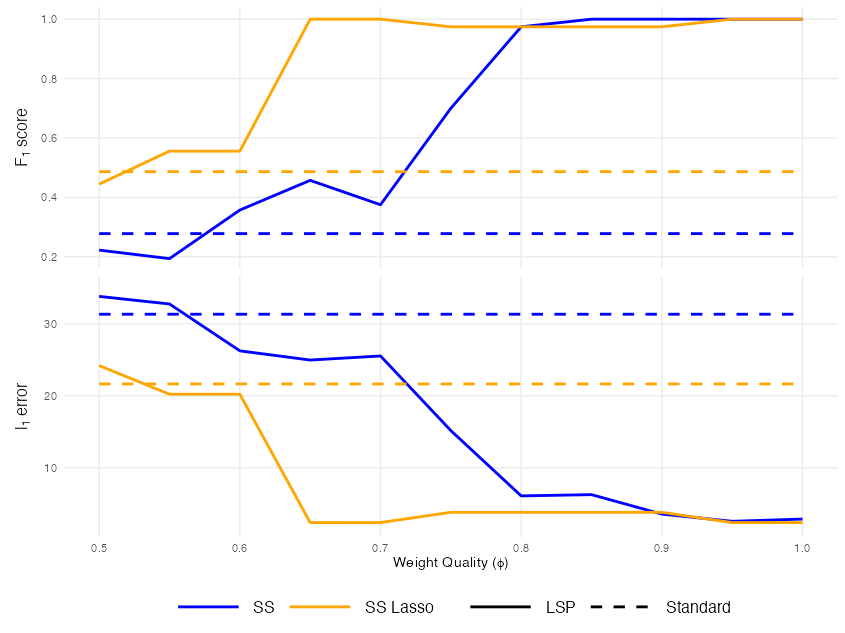
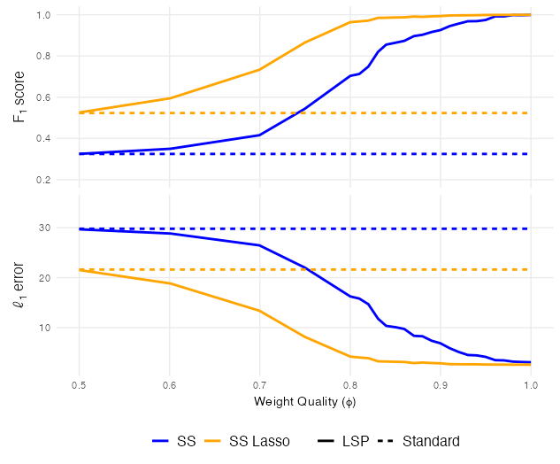

# LLM Sparsity Prior for Robust Feature Selection

This repository implements the **LLM Sparsity Prior (LSP)**, a Bayesian variable selection framework. LSP brings *a priori* feature importance from Large Language Models (LLMs) into the Spike-and-Slab (SS) and Spike-and-Slab Lasso (SSL) priors.

The repository has three components:

1) **Core implementation:** posterior estimation for LSP (SS) by MCMC and LSP (SSL) by MAP coordinate descent.
2) **Simulations:** comparative studies across feature weight quality, the concentration parameter $\eta$, and correlation structure.
3) **Data application:** LLM prompt templates and an analysis of Acute Kidney Injury (AKI) after cardiac surgery.

- [Method at a Glance](#method-at-a-glance)
- [Quick Start](#quick-start)
- [Function Reference](#function-reference)
- [Using Your Own LLM Weights](#using-your-own-llm-weights)
- [Reproducing the Simulations](#reproducing-the-simulations)
- [AKI Data Application](#aki-data-application)
- [Acknowledgments](#acknowledgments)

## Method at a Glance
 
Each feature $j$ gets an LLM-derived importance weight $w_j$. LSP sets the prior inclusion probabilities to
 
$$
\theta_j = s \cdot u_j, \qquad u_j = \frac{w_j^{\eta}}{\frac{1}{p}\sum_{k=1}^p w_k^{\eta}},
$$
 
where $s$ is the global sparsity and $\eta \ge 0$ controls the influence of the LLM weights. $\eta$ is assigned a hyperprior that includes a point mass at $\eta = 0$, which recovers the standard spike-and-slab prior. When the LLM weights are uninformative, the posterior shifts toward $\eta = 0$, so LSP falls back to its baseline instead of being misled.

### R packages
 
The **core methods** (`LSP_SS/`, `LSP_SSL/`) use only base R plus a C compiler. The simulations and data application need additional packages:
 
```r
# Simulations and data application
install.packages(c(
  "MASS", "tidyverse", "furrr", "future", "rsample", "glmnet",
  "pROC", "simstudy", "Mhorseshoe"
))
 
# Only needed for the plotting example below
install.packages(c("ggh4x", "latex2exp"))
```

### Compile the Spike-and-Slab Lasso
 
LSP (SSL) calls compiled C code, which you must build locally. This needs a C toolchain: Xcode Command Line Tools on macOS, `build-essential` on Linux, or [Rtools](https://cran.r-project.org/bin/windows/Rtools/) on Windows. To compile, run the following command in your terminal at the repository root.
```bash
cd LSP_SSL
R CMD SHLIB LSP_SSL_descent.c LSP_SSL_functions.c -o lsp_ssl.so   # macOS / Linux
# R CMD SHLIB LSP_SSL_descent.c LSP_SSL_functions.c -o lsp_ssl.dll # Windows
```

The compiled files (`*.o`, `*.so`) are gitignored, so every clone must build them.

## Quick Start
```r
source("LSP_SS/LSP_SSR_random_s.R")
source("LSP_SSL/LSP_SSLR.R")

# Generate synthetic data
set.seed(1); n <- 50; p <- 100; signals <- 5

X <- MASS::mvrnorm(n, mu = rep(0, p), diag(p))
beta_true <- c(rep(0, p - signals), rep(1, signals))
alpha_true <- 1
y <- X %*% beta_true + alpha_true + rnorm(n, 0, sd = 1)

# Define LLM-generated feature weights (in practice, these come from the LLM prompt)
weights <- c(rep(1, p - signals), rep(5, signals)) # perfect weights

# LSP (SS): MCMC sampler with random sparsity
lsp_ss_fit <- lsp_random_ss_gibbs_sampler(
  X = X,
  y = y,
  weights = weights)

# Posterior means; the first element is the intercept
lsp_ss_beta_est <- colMeans(lsp_ss_fit$beta)

# LSP (SSL): MAP estimation along a lambda0 path
lsp_ssl_fit <- lsp_ssl_map(
  X = X,
  y = y,
  weights = weights,
  penalty = "adaptive"
)

 # Select model from descent (use BIC to select lambda_0)
 lsp_ssl_beta_est <- select_lambda0_bic(lsp_ssl_fit, X = X, y = y)

 # Print estimates
 round(lsp_ss_beta_est, digits = 2)
 # [1] 0.77 0.00 0.00 ... 0.00 0.85 1.05 1.11 0.86 1.15
 round(as.vector(lsp_ssl_beta_est), digits = 2)
 # [1] 0.95 0.00 0.13 ... 0.00 0.82 0.94 0.87 0.81 0.85
```

Setting `weights = NULL` (or `E_space = 0`) in either function fits the standard, weight-free SS or SSL model.

## Function Reference
 
| Function | File | Estimation | Description |
|---|---|---|---|
| `lsp_fixed_ss_gibbs_sampler()` | `LSP_SS/LSP_SSR_fixed_s.R` | MCMC | LSP (SS) with fixed global sparsity |
| `lsp_random_ss_gibbs_sampler()` | `LSP_SS/LSP_SSR_random_s.R` | MCMC | LSP (SS) with a Beta(`a_s`, `b_s`) prior on sparsity $s$ |
| `lsp_ssl_map()` | `LSP_SSL/LSP_SSLR.R` | MAP | LSP (SSL) coordinate descent along a $\lambda_0$ path |
| `select_lambda0_bic()` | `LSP_SSL/LSP_SSLR.R` | — | Selects $\lambda_0$ by BIC; returns `c(intercept, beta)` |

**Common arguments**
 
| Argument | Meaning |
|---|---|
| `X`, `y` | Design matrix ($n \times p$) and response. Columns of `X` are standardized internally, coefficients are returned on the original scale, and the intercept is added internally |
| `weights` | LLM weight vector of length $p$, in the same order as the columns of `X`. `NULL` gives the standard model |
| `E_space` | Grid of $\eta$ values. `NULL` builds a grid automatically, and `0` disables weighting. $\eta = 0$ is always included |
| `eta_pi_0` | Prior probability that $\eta = 0$ (default `0.5`); the remaining mass is split uniformly over the nonzero values of `E_space`. Set `eta_pi_0 = 0` with a single `E_space` value (e.g., `E_space = 2`) to fix $\eta$ |
| `iter`, `burn_in`, `thin` | MCMC settings (SS samplers; defaults `10000`, `5000`, `1`) |
| `return_samples` | SS samplers: `TRUE` returns all draws, `FALSE` returns posterior means only (saves memory) |
| `penalty` | SSL: `"adaptive"` (random $s$) or `"separable"` (fixed $s$) |
 
**SS sampler output:** a list with `beta` (intercept first), `gamma` (inclusion indicators), `invsigma_2`, `eta`, `s` (random-sparsity sampler only), acceptance indicators, and `p_eta_0`. With `return_samples = FALSE`, each element is a posterior mean.
 
**SSL output:** an `"SSLASSO"`-class list with `beta` ($p \times$ `nlambda`), `intercept`, `lambda0`, `thetas`, `sigmas`, and `best_eta` (selected $\eta$ at each $\lambda_0$).

## Using Your Own LLM Weights
 
1. **Elicit weights.** Use [`AKI_Data_Application/weight_prompts/prompt_original.ipynb`](AKI_Data_Application/weight_prompts/prompt_original.ipynb) as a template. Replace the dataset background and feature list with your own. The notebook scores features in batches with structured JSON output and saves a CSV.
2. **Expected CSV format.** One row per feature:
   | value | importance | reason |
   |---|---|---|
   | `age` | `3` | Free-text LLM justification |
   `value` is the column name in `X`, and `importance` is an ordinal score (1–5 in the original prompt; 1–10 in the `rubric10` variant).
3. **Align and fit.** Order the weights to match the columns of `X`, then pass `weights = importance` to any LSP function.
> The prompt notebooks were written for Google Colab (they mount Google Drive) and call the OpenAI API (`gpt-5.2`). Before running locally, add your API key and update the data paths. Python requirements: `openai`, `pydantic`, `pandas`, `numpy`.

## Reproducing the Simulations
 
### One replication (weight quality)

<details>
<summary>Show code (runtime: this fits 4 models at 11 weight-quality levels with p = 1000)</summary>

```r
library("ggplot2")
source("LSP_SS/LSP_SSR_random_s.R")
source("LSP_SSL/LSP_SSLR.R")
source("Simulations/weight_quality_support.R")

# Generate synthetic data
set.seed(1); n <- 100; p <- 1000; signals <- 20
cov_mat <- simstudy::genCorMat(p, cors = rep(0.5, choose(p, 2)))
X <- MASS::mvrnorm(n, mu = rep(0, p), cov_mat)
gamma_true <- c(rep(0, p - signals), rep(1, signals))
beta_true <- c(rep(0, p - signals), rep(1, signals))
alpha_true <- 1
y <- X %*% beta_true + alpha_true + rnorm(n, 0, sd = 1)

# Train baseline (weight-free) models
baseline_ssl <- lsp_ssl_map(X, y, penalty = "adaptive") |>
  select_lambda0_bic(X = X, y = y)

baseline_ss <- lsp_random_ss_gibbs_sampler(
  X, y, iter = 30000, burn_in = 5000, return_samples = FALSE)

# Weight quality grid (phi = 0.5: uninformative weights; phi = 1: perfect weights)
phi_range <- c(0.5, 0.55, 0.6, 0.65, 0.7, 0.75, 0.80, 0.85, 0.90, 0.95, 1.00)
eta_range <- seq(1, 10, by = 1)

metrics <- map_dfr(phi_range, function(phi) {
  # Generate synthetic weights of quality phi
  weights <- generate_weights(phi, gamma_true, categories = 5)
 
  # Train LSP models
  lsp_ss_fit <- lsp_random_ss_gibbs_sampler(
    X = X, y = y, E_space = eta_range, weights = weights,
    iter = 30000, burn_in = 5000, return_samples = FALSE
  )
 
  lsp_ssl_fit <- lsp_ssl_map(
    X = X, y = y, E_space = eta_range, weights = weights, penalty = "adaptive"
  ) |>
    select_lambda0_bic(X = X, y = y)
 
  all_fits <- list(
    "Standard_SS_Lasso" = baseline_ssl,
    "Standard_SS"       = baseline_ss,
    "LSP_SS_Lasso"      = lsp_ssl_fit,
    "LSP_SS"            = lsp_ss_fit
  )
 
  # Compute l1 error and F1 score
  imap_dfr(all_fits, function(model_object, model_name) {
    if (is.numeric(model_object)) {
      gamma_predict <- as.vector(model_object != 0)[-1]
      l1_error <- sum(abs(as.vector(model_object) - c(alpha_true, beta_true)))
    } else {
      gamma_predict <- model_object$gamma
      l1_error <- sum(abs(model_object$beta - c(alpha_true, beta_true)))
    }
 
    fp <- length(which(gamma_predict[gamma_true == 0] > 0.5))
    fn <- length(which(gamma_predict[gamma_true == 1] < 0.5))
    tp <- sum(gamma_true) - fn
 
    precision <- if_else(tp == 0, 0, tp / (tp + fp))
    recall <- if_else(tp == 0, 0, tp / (tp + fn))
    f1_score <- if_else(
      precision + recall == 0, 0, 2 * (precision * recall) / (precision + recall)
    )
 
    tibble(
      phi = phi,
      Method = if_else(grepl("Lasso", model_name), "SS Lasso", "SS"),
      Type = if_else(grepl("Standard", model_name), "Standard", "LSP"),
      l1_error = l1_error,
      F1_score = f1_score
    )
  })
})
 
metric_labels <- as_labeller(
  c("F1_score" = "F[1]~score", "l1_error" = "l[1]~error"),
  default = label_parsed
)
 
metrics |>
  pivot_longer(cols = c(F1_score, l1_error), names_to = "metric", values_to = "value") |>
  ggplot(aes(x = phi, y = value)) +
  geom_line(aes(color = Method, linetype = Type), linewidth = 1) +
  facet_grid(metric ~ ., switch = "y", scales = "free_y", labeller = metric_labels) +
  ggh4x::facetted_pos_scales(
    y = list(
      metric == "F1_score" ~ scale_y_continuous(limits = c(0.20, 1)),
      metric == "l1_error" ~ scale_y_continuous(limits = c(2, 35))
    )
  ) +
  theme(
    legend.title = element_blank(),
    legend.position = "bottom",
    legend.key.width = unit(2, "cm"),
    legend.text = element_text(size = 12),
    strip.placement = "outside",
    strip.background = element_blank(),
    strip.text.y.left = element_text(size = 12),
    panel.grid.minor = element_blank()
  ) +
  labs(x = latex2exp::TeX("Weight Quality ($\\phi$)"), y = NULL) +
  scale_color_manual(values = c("SS" = "blue", "SS Lasso" = "orange")) +
  scale_linetype_manual(values = c("LSP" = "solid", "Standard" = "dashed"))
```

As weight quality improves, both LSP methods substantially outperform their baselines. 
<p align="center">
  
</p>


### Full simulation studies
 
| Script | Study | Grid |
|---|---|---|
| [`Simulations/weight_quality_sims.R`](Simulations/weight_quality_sims.R) | Weight quality, exchangeable correlation ($\rho = 0.5$) | $\phi \in [0.5, 1]$, $n \in \{100, 250\}$, 500 reps |
| [`Simulations/block_corr_sims.R`](Simulations/block_corr_sims.R) | Weight quality, block-diagonal correlation ($\rho = 0.7$, blocks of 50) | $\phi$, $n \in \{100, 250\}$, 500 reps |
| [`Simulations/eta_sensitivity_sims.R`](Simulations/eta_sensitivity_sims.R) | Sensitivity to fixed $\eta$ | $\phi \in \{0.8, 0.9\}$, $\eta \in \{1, \dots, 20\}$, 500 reps |
 
All studies use $p = 1000$ with 20 true signals. Comparison methods include the standard SS/SSL, LLM-Lasso, and the horseshoe. Simulation helpers (weight generation, metrics) are in [`Simulations/weight_quality_support.R`](Simulations/weight_quality_support.R), and helpers shared across the repository (including LLM-Lasso) are in [`utils.R`](utils.R).

**Running notes**
 
- The scripts run in parallel with `future::plan(multicore)`, using up to 20–50 physical cores. `multicore` is unavailable on Windows and in RStudio, where it falls back to sequential execution. Full runs are meant for a computing cluster.
- Results are written as one CSV per grid cell (e.g., `weights0.8_n100.csv`) to the working directory.
Aggregated over 500 replications, LSP methods match or outperform their baselines, and the gains grow with weight quality. Performance holds up even at $\phi = 0.5$, where the LLM weights carry no signal.
 
<p align="center">
  
</p>

## AKI Data Application
 
The application predicts postoperative AKI (creatinine ratio at hour 60) in cardiac surgery patients, using perioperative and ICU EHR features. It covers five clinical subgroups: age > 80, female smokers, Black men, liver disease, and immunocompromised.
 
> **Data availability:** the dataset, `t60_reg_data.csv`, is a private dataset and not available in this repository. The analysis scripts expect the file at the repository root, with columns `pat_id`, `creatinine_ratio` (outcome), and the feature columns.
 
| Script | Purpose |
|---|---|
| `analysis/aki_subsets.R` | All LSP and baseline models on the five subgroups, with repeated cross-validation |
| `analysis/aki_low_data.R` | Performance across training set sizes (low-data regime) |
| `analysis/aki_weight_sensitivity.R` | Sensitivity to the prompt: 5 prompt variants × 5 LLM runs (age > 80 subgroup) |
| `analysis/aki_single_run.R` | Fits all models to each full subgroup (no test-set) |
| `analysis/aki_analysis_support.R` | Data preparation, CV partitioning, and train/evaluate routines |
 
**Prompt variants** (`weight_prompts/`) and the weight files they generate (`weights/`):
 
| Prompt notebook | Variant | Weight files |
|---|---|---|
| `prompt_original.ipynb` | Original prompt | `aki_weights_original_{1..5}.csv` |
| `prompt_adjust_task.ipynb` | Task definition adjusted | `aki_weights_task_{1..5}.csv` |
| `prompt_adjust_reasoning_structure.ipynb` | Reasoning structure adjusted | `aki_weights_reasoning_{1..5}.csv` |
| `prompt_adjust_collinearity_constraints.ipynb` | Collinearity constraints adjusted | `aki_weights_collinearity_{1..5}.csv` |
| `prompt_adjust_scoring_rubric10.ipynb` | 10-point scoring rubric | `aki_weights_rubric10_{1..5}.csv` |
| `prompt_original_<subgroup>.ipynb` | Original prompt, subgroup-specific | `aki_weights_original_<subgroup>.csv` |
| `prompt_probabilities[_<subgroup>].ipynb` | Plug-in prior: LLM gives inclusion probabilities directly | `aki_weights_probabilities_*.csv` |
 
`<subgroup>` ∈ {`female_smoker`, `black_men`, `liver_disease`, `immunocompromised`}. All weights were generated with `gpt-5.2`.

## Acknowledgments
 
- The SSL coordinate descent is adapted from the [SSLASSO](https://github.com/cran/SSLASSO) package (Ročková & George, *JASA*, 2018).
- The LLM-Lasso comparison is adapted from [Zhang et al.](https://github.com/pilancilab/LLM-Lasso)